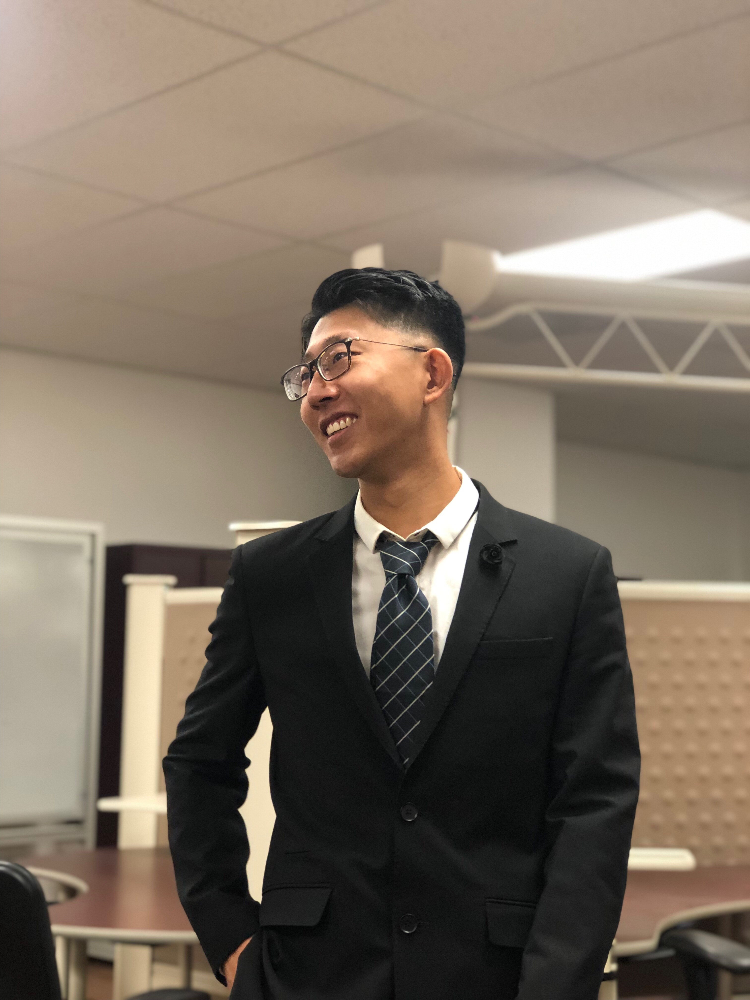
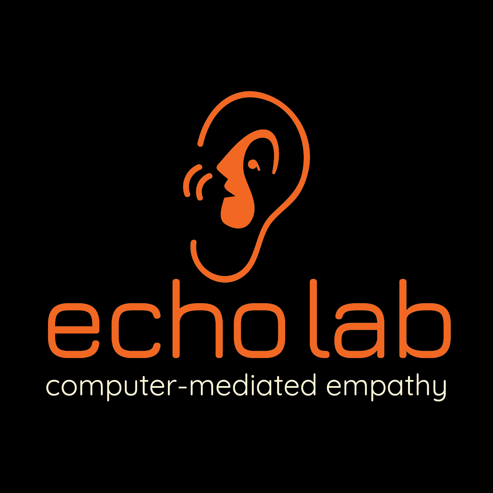

    

   
   

## Hello, welcome to my homepage!
   

### About Me

    

 
Hi there, I am Donghan Hu, a second year Ph.D. student in Conputer Science department in [Virginia Tech](https://vt.edu/) since 2019. I received my Master degree in Computer Sceience in 2019 at Virginia Tech, advisored by [Dr. Sang Won lee](https://people.cs.vt.edu/sangwonlee/). Before this, I received my bachelor degree in Computer Science 2017 at [Northeastern University](https://english.neu.edu.cn/) in Shenyang, China.

Currently, my research area is Human-Computer Interactino (HCI) and I am being advised by Dr. Sang Won Lee. He is REALLY a great advisor and professor. My research projects lies in helping people reconstruct their mental context and retrieve digital resources (e.g., websites, docuemtns, and applications) for their previous works. Tasks resumptions and working context retrieval are two essential problems, which take people lots time about recalling and searching. To solve these problems, I am utilizing screenshot-based technologly. Besides, I am interested in other topics in HCI, like Augmented Reality(AR) and communications. Please see my projects and publications for further information. For contact, please see the bottom of this page.

### Publications
[Scrapbook: Screenshot-based Bookmark for Effective Curation of Digital Resources.](https://dl.acm.org/doi/abs/10.1145/3379350.3416181)(2020 UIST poster) 

[ScreenTrack: Using a Visual History of a Computer Screen to Retrieve Documents and Web Pages.](https://dl.acm.org/doi/abs/10.1145/3313831.3376753)(2020 CHI paper) 

[ScreenTrack: Using Visual History for Self-trackingComputer Activities and Retrieving Working Context.](https://dl.acm.org/citation.cfm?id=3357110) (2019 UIST poster) 

[ScreenTrack: Using Visual History for Self-tracking Computer Activities and Retrieving Working Context.](https://vtechworks.lib.vt.edu/handle/10919/91181?show=full) (Master thesis)

### Research Projects

#### ScreenTrack
Computers are used for various purposes, so frequent context switching is inevitable. Retrieving the documents, files, and web pages that have been used for a task can be a challenge. While amny applications provide a history of recent documents for users to resume work, this is not sufficient to retrieve all the digital resources relevant to a given primary document. The histories currently available do not take into account the complex dependencies among resources across applications. To address this problem, we tested the idea of using a visual history of a computer screen to retrieve digital resources within a few days of their use through the development of Scrapbook. Scrapbook is software that captures screenshots of a computer at regular intervals. It then generates a time-lapse video from the captured screenshots and lets users retrieve a recently opened document or web page from a screenshot after recognizing the resource by its appearance.
   

   

#### AR Collaboration with Bare Hands
In many collaborative tasks, the need for joint attention arises when one of the users wants to guide others to a specific location or target in space. If the collaborators are co-located and the target position is in close range, it is almost instinctual for users to refer to the target location by pointing with their bare hands. While such pointing gestures can be efficient and effective in real life, performance will be impacted if the target is in augmented reality (AR), where depth cues like occlusion may be missing if the pointer's hand is not tracked and modeled in 3D. We present a study utilizing head-worn AR displays to examine the effects of incorrect occlusion cues on spatial target identification in a collaborative barehanded referencing task. Our work also identified mixed results of the effect of spatial relationships between users.

    

#### Scrapbook
Modern users typically open multiple software, websites, and documents for daily tasks. Retrieving previously used digital resources, such as web pages and documents, for knowledge workers is inevitable, but can be time-consuming. People may fail to remember where the resource is. In addition, sometimes, users need to retrieve digital resources across multiple applications to resume a computing task. However, the current methods - bookmarks and file systems - for curating such resources are limited in their capacity and dispersed over multiple applications.  To address the above problems, we test the idea of curating digital resources by developing Scrapbook, a software that allows users to curate digital resources with screenshots. Scrapbook allows users to take a screenshot of their computer screen and stores metadata of captured applications in the screenshot. Later, users can utilize multimodal (visual and textual) information to retrieve information that they want to recall or to restore the working context of a certain task. 

### Upcoming Travel & Conference
Definitely no travel plan at this moment! Stay home and stay safe.
CHI 2021: May 8-13, 2021

### Support or Contact
Address: 2202 Kraft Drive, Knowledge Works II Blacksburg, VA 24060 

E-mail: hudh0827@vt.edu
