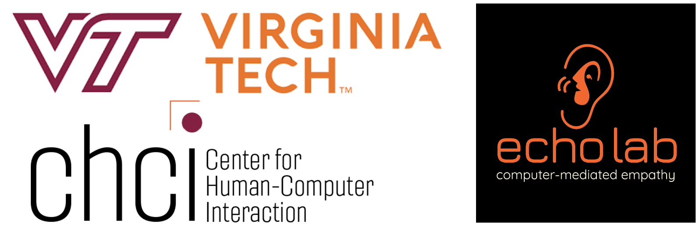
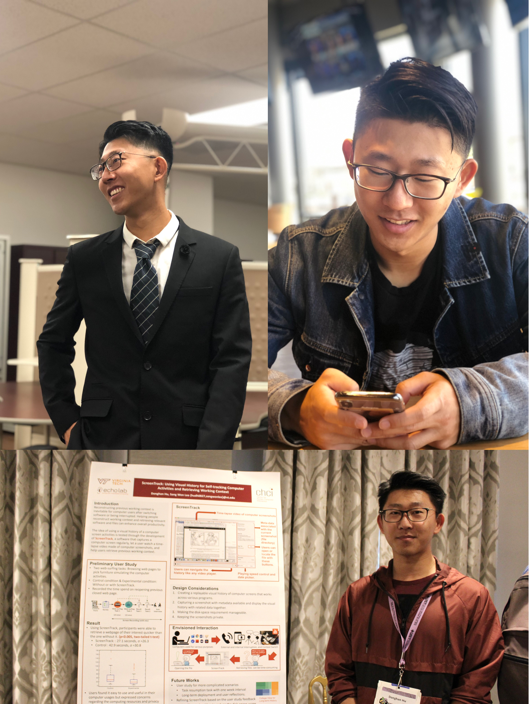
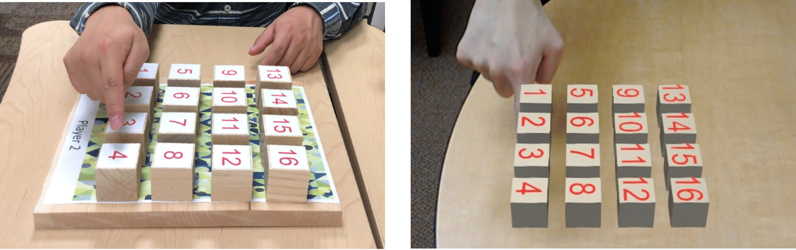
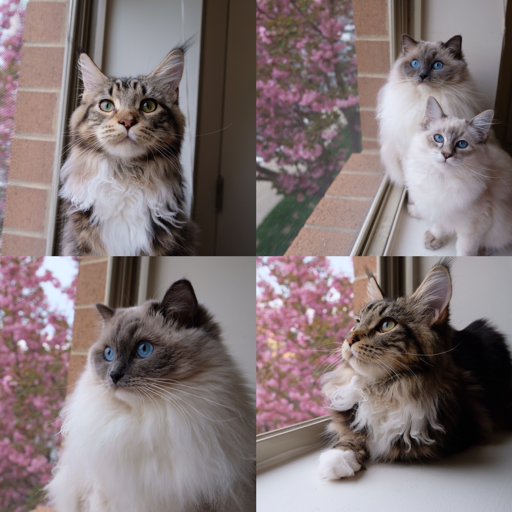

    

## Hello, welcome to my homepage!

Looking for an internship for Summer 2023.

### About Me

Hi there, my name is Donghan Hu from China, a fourth-year Ph.D. student in the Computer Science department at [Virginia Tech](https://vt.edu/). I received my Master's degree in Computer science in 2019 at Virginia Tech, advised by [Dr. Sang Won lee](https://people.cs.vt.edu/sangwonlee/). Before this, I received my bachelor's degree in Computer Science in 2017 at [Northeastern University](https://english.neu.edu.cn/) in Shenyang, China.

Currently, my research area is Human-Computer interaction (HCI), and Dr. Sang Won Lee is advising me. He is REALLY a great and warm-hearted advisor who is generous to give his time to help us with valuable advice. Our HCI lab calls "[Echolab](https://echolab.cs.vt.edu)" and we are targeting to understand and create novel methods to foster empathic interaction among people using computational systems. My research project lies in helping modern knowledge workers reconstruct their mental context and retrieve digital resources (e.g., websites, documents, and applications) to enhance their working productivity via self-tracking and self-reflection. Tasks resumptions and working context retrieval are two fundamental problems that take people lots of time to recall and search. To solve these problems, I am utilizing screenshot-based technology, self-reflection models, and metadata mixed with visual cues and textual cues. Please see my projects and publications for further information. For contact, please see the bottom of this page.  

    

### Publications
[Scrapbook: Screenshot-Based Bookmarks for Effective Digital Resource Curation across Applications.](2022 UIST Paper) 

[Scrapbook: Screenshot-based Bookmark for Effective Curation of Digital Resources.](https://dl.acm.org/doi/abs/10.1145/3379350.3416181)(2020 UIST Poster) 

[The Effects of Incorrect Occlusion Cues on the Understanding of Barehanded Referencing in Collaborative Augmented Reality.](https://www.frontiersin.org/articles/10.3389/frvir.2021.681585/full)(Frontiers in Virtual Reality) 

[ScreenTrack: Using a Visual History of a Computer Screen to Retrieve Documents and Web Pages.](https://dl.acm.org/doi/abs/10.1145/3313831.3376753)(2020 CHI Paper) 

[ScreenTrack: Using Visual History for Self-trackingComputer Activities and Retrieving Working Context.](https://dl.acm.org/citation.cfm?id=3357110) (2019 UIST Poster) 

[ScreenTrack: Using Visual History for Self-tracking Computer Activities and Retrieving Working Context.](https://vtechworks.lib.vt.edu/handle/10919/91181?show=full) (Master Thesis)

### Research Projects

#### (1): ScreenTrack
Computers are used for various purposes, so frequent context-switching is inevitable. Retrieving the documents, files, and web pages used for a task can be challenging. While many applications provide a history of recent documents for users to resume work, this is insufficient to retrieve all the digital resources relevant to a given primary document. The currently available do not consider the complex dependencies among resources across applications. To address this problem, we tested the idea of using a visual history of a computer screen to retrieve digital resources within a few days of their use through the development of Scrapbook. Scrapbook is software that captures screenshots of a computer at regular intervals. It then generates a time-lapse video from the captured screenshots. After recognizing the resource by its appearance, it lets users retrieve a recently opened document or web page from a screenshot. **Below is the video about ScreenTrack.**
   

   

#### (2): AR Collaboration with Bare Hands
In many collaborative tasks, the need for joint attention arises when one of the users wants to guide others to a specific location or target in space. If the collaborators are co-located, and the target position is in close range, it is almost instinctual for users to refer to the target location by pointing with their bare hands. While such pointing gestures can be efficient and effective in real life, performance will be impacted if the target is in augmented reality (AR), where depth cues like occlusion may be missing if the pointer's hand is not tracked and modeled in 3D. We present a study utilizing head-worn AR displays to examine the effects of incorrect occlusion cues on spatial target identification in a collaborative barehanded referencing task. Our work also identified mixed results on the impact of spatial relationships between users.

    

#### (3): Scrapbook
Modern users typically open multiple software, websites, and documents for daily tasks. Retrieving previously used digital resources, such as web pages and documents, for knowledge workers is inevitable but can be time-consuming. People may fail to remember where the resource is. In addition, sometimes, users need to retrieve digital resources across multiple applications to resume a computing task. However, the current methods - bookmarks and file systems - for curating such resources are limited in their capacity and dispersed over multiple applications. To address the above problems, we test the idea of curating digital resources by developing Scrapbook, a software that allows users to curate digital resources with screenshots. Scrapbook enables users to take a screenshot of their computer screen and stores metadata of captured applications in the screenshot. Later, users can utilize multimodal (visual and textual) information to retrieve the information they want to recall or restore the working context of a certain task. 

    

### Previous Experience
**GTA & GRA** Virginia Tech. (Since 2019 Aug) 
Graduate assistant for Network Architecture Programming (CS 4254), Fundamentals of Information Security (CS 5560), Intro to Programming in Python (CS1064), and Software Design & Data Structures (CS2114)  
Developed and tested applications to help modern knowledge workers enhance working productivity. Conducted in-lab & field studies to validate research contribution.  

**Internship:** Social Smart IT Company. (2016 June - Aug)  
Set up and deployed company servers in Java for testing and launching services, maintaining servers, and debugging. 
Led team to design and develop websites' frameworks based on customized requirements. Scripted web pages' content and implemented corresponding functionalities for customers on the world-wide scope.  

### Upcoming Travel & Conference

**UIST 2022: Oct 30 - Nov 3rd, 2023**

### Personal Interests
Bdminton, snowboarding, swimming, video games, and pixel arts.  
By the way, say hi to my cats (Matrix, Mocha, and Vector)! 

    

### Support or Contact
Address: 2202 Kraft Drive, Knowledge Works II Blacksburg, VA 24060 

E-mail: hudh0827@vt.edu
